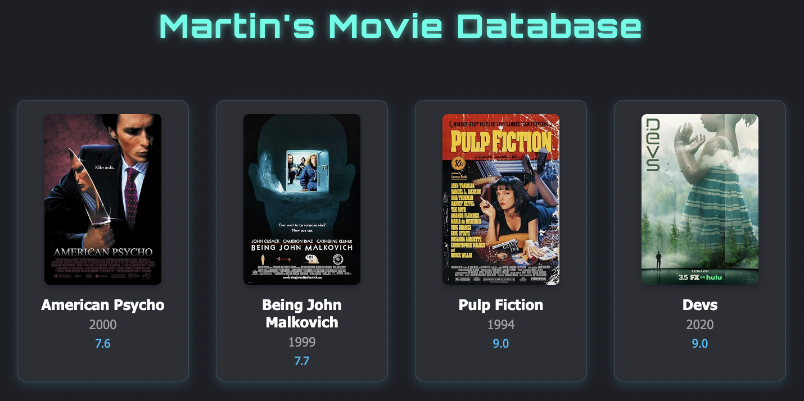

# Martin's Movie Database

A retro-tech-inspired movie management app with a command-line interface and website generation.  
Built with Python and styled in a retro-sci-fi/techno aesthetic using HTML & CSS.


---

## Features

- Add, delete, and update movies
- Store data in JSON (with interface support for CSV and future storage types)
- Fetch movie info automatically via the OMDb API
- View movie stats and generate histograms
- Sort, filter, and search through your collection
- Export a stylish HTML website of your movie library
- Retro-inspired CSS styling and layout

---

## Technologies

- Python (OOP, CLI)
- JSON storage (interface-ready for CSV, Firebase, etc.)
- [OMDb API](http://www.omdbapi.com/) integration
- `matplotlib` for histograms
- HTML + CSS (sci-fi themed)
- Designed for terminal + static site output

---

## Project Structure
```
project/
  ├── main.py                     # Entry point of the program
  ├── api/                        # API-related logic
  │   ├── omdb_api.py             # External API logic
  │   ├── movie_storage.py        # Logic for movie-related data persistence
  ├── core/                       # Core app logic
  │   ├── movie_app.py            # Main class and command routing
  │   ├── process_movies.py       # Searching, sorting, filtering
  │   ├── stats.py                # Statistics + histogram
  ├── storage/                    # Data persistence logic
  │   ├── storage_json.py         # Persistent storage in JSON
  │   ├── storage_csv.py          # Persistent storage in CSV
  ├── services/                   # External services like APIs
  ├── static/                     # Static website resources
  ├── templates/                  # HTML templates (if applicable)
  ├── style.css                   # Website styles
  ├── .env                        # API key (gitignored)
  ├── .gitignore                  # Gitignore sensitive files and folders
  ├── README.md                   # Project overview and setup instructions
  ├── tests/                      # Unit and integration tests
```

## Install requirements (if needed)
pip install matplotlib requests dotenv


## Run the program
python movie_app.py


## Website Output
After selecting “12. 
Generate website”, an index.html file will be created using the template and your movies. 
Open it in any browser to view!
Make sure the static/style.css file stays in the same folder as index.html.


## OMDb API Setup
Go to omdbapi.com
Sign up and get a free API key
Replace it in omdb_api.py:
API_KEY = "your_api_key_here"


## Theme
Retro sci-fi feel (metallic blue, glowing green, monospaced font).


## Future Ideas
Add CSV and SQLite storage options
Deploy website with GitHub Pages
Include movie posters locally or cache them
Advanced filtering (e.g., by director, genre)


## Author
Martin Enke
Built during Masterschool Software Engineering Bootcamp.